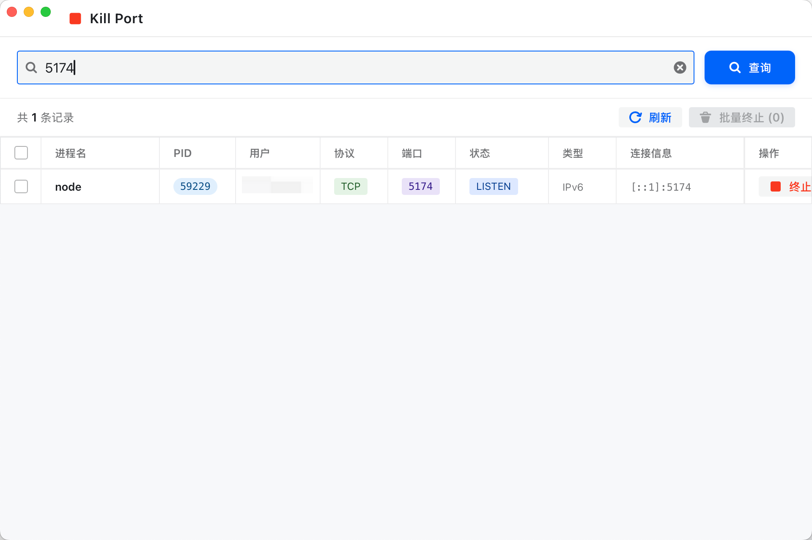

# Kill Port

一个轻量级的端口进程管理桌面工具，帮你告别繁琐的命令行操作。




## 为什么做这个

日常开发中，端口冲突是一个极其高频的问题：

```bash
# 你想启动服务，结果：
Port 8080 is already in use

# 然后你得：
lsof -i :8080          # 先查谁占了
# 从一堆输出里找到 PID...
kill -9 12345          # 再手动杀掉
```

每次都得敲 `lsof -i :端口号`，从一堆输出里肉眼找 PID，再 `kill`，端口一多就烦得要死。更别提有时候一个端口被好几个进程占着，得一个个杀。

**这个工具就是为了解决这个问题** —— 输入端口号，看到所有占用进程的详细信息，勾选，一键终止，完事。

## 功能

- **多端口搜索** — 支持同时输入多个端口号（空格、逗号、分号分隔），并发查询合并去重
- **详细信息** — 展示进程名、PID、用户、协议、端口、连接状态、连接信息等完整字段
- **单个终止** — 对单个进程点击「终止」按钮，二次确认后终止
- **批量终止** — 勾选多个进程，一键批量终止
- **安全机制** — 所有终止操作均有 Popconfirm 二次确认，防止误杀
- **优雅终止** — 优先发送 SIGTERM 信号，失败后再发送 SIGKILL

## 技术栈

| 层 | 技术 |
|---|------|
| 桌面框架 | [Wails v2](https://wails.io/) |
| 后端 | Go — 调用 `lsof` 解析端口进程、`syscall.Kill` 终止进程 |
| 前端 | React + Vite |
| UI 组件 | [Semi Design](https://semi.design/) (Table / Tag / Popconfirm / Toast 等) |
| 样式 | SCSS |

## 项目结构

```
kill-port/
├── main.go              # Wails 入口，窗口配置
├── app.go               # Go 后端核心：端口查询 & 进程终止
├── Makefile             # 构建命令（dev / build / dmg / clean）
├── frontend/
│   ├── src/
│   │   ├── App.jsx      # React 主页面（Semi Table + 搜索 + 操作）
│   │   ├── App.scss     # 亮色主题样式
│   │   └── main.jsx     # 入口
│   ├── index.html
│   └── wailsjs/         # Wails 自动生成的 Go 绑定
├── build/               # 构建产物 & 应用图标
├── wails.json           # Wails 项目配置
└── go.mod
```

## 快速开始

### 前置要求

- [Go](https://go.dev/) >= 1.21
- [Node.js](https://nodejs.org/) >= 18
- [Wails CLI](https://wails.io/docs/gettingstarted/installation) v2

```bash
# 安装 Wails CLI（如果没有的话）
go install github.com/wailsapp/wails/v2/cmd/wails@latest

# 打包 DMG 需要 create-dmg（可选）
brew install create-dmg
```

### 开发

```bash
git clone git@github.com:advance-hub/kill-port.git
cd kill-port

# 开发模式（热更新）
make dev
```

### 构建

```bash
# 构建 macOS .app
make build

# 构建 .app 并打包为 .dmg 安装包（需要 brew install create-dmg）
make dmg

# 清理构建产物
make clean
```

构建产物：
- `.app` — `build/bin/kill-port.app`，双击即可运行
- `.dmg` — `build/bin/Kill Port.dmg`，打开后拖入 Applications 安装

## 原理

1. 用户输入一个或多个端口号（支持空格、逗号、分号分隔）
2. Go 后端并发执行 `lsof -i :端口 -P -n`，解析输出为结构化数据，合并去重
3. 前端通过 Wails 绑定调用 Go 方法，展示在 Semi Design Table 中
4. 用户选择进程后，Go 后端通过 `syscall.Kill` 发送信号终止进程（先 SIGTERM，失败再 SIGKILL）
5. 终止后自动刷新列表

## License

MIT
